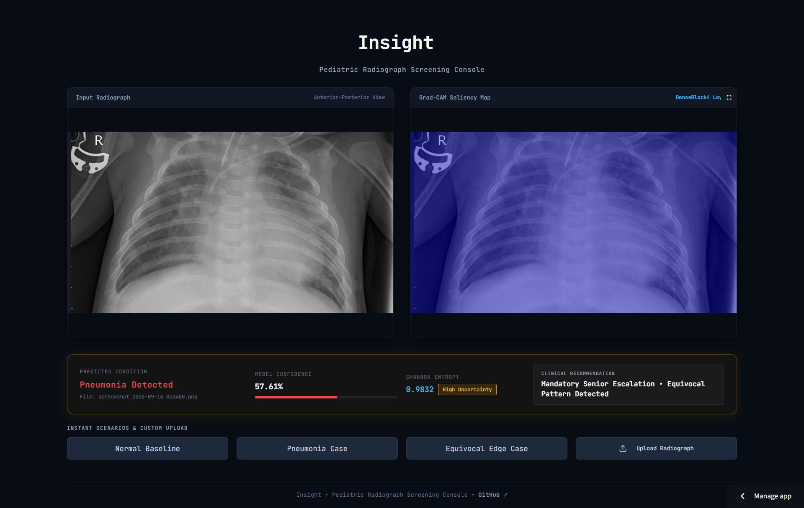

<div align="center">

# Insight: Medical Image Prediction with Explainability & Uncertainty

An end-to-end deep learning system designed for pediatric chest radiograph classification (Normal vs. Pneumonia) integrating interpretability (Grad-CAM) and predictive uncertainty estimation to serve as a reliable clinical decision support tool. | [**Live Demo**](https://insight-xzfaemk5ywzdkc3b4vmhm7.streamlit.app/)

[](docs/evaluation.md#2-final-benchmark-performance)
[](docs/evaluation.md#2-final-benchmark-performance)
[](docs/evaluation.md#2-final-benchmark-performance)
[](docs/architecture.md)
[](LICENSE)

[Overview](#overview) • [Performance](#technical-performance-snapshot) • [Key Features](#key-features) • [Quick Start](#quick-start) • [Structure](#project-structure) • [Documentation](#documentation) • [Disclaimer](#disclaimer)

<br />

<a href="https://insight-xzfaemk5ywzdkc3b4vmhm7.streamlit.app/" target="_blank">
  
</a>

</div>

---

## Overview

Insight is developed to support clinical radiologist workflows through automated pre-screening and diagnostic verification. Rather than providing an isolated black-box classification, the framework couples discriminative inference with localized feature attribution and epistemic uncertainty quantification. This enables calibrated triaging, routing low-risk screenings toward standard review while escalating ambiguous or high-uncertainty instances for mandatory senior radiologist consultation.

## Technical Performance Snapshot

Evaluated exclusively on the official held-out Kaggle test set ($N = 624$ radiographs, Kermany et al., 2018):

| Metric | Benchmark Score | Operational Target | Clinical Relevance |
| :--- | :---: | :---: | :--- |
| **Sensitivity (Recall)** | **99.74%** | $\ge 98.0\%$ | Primary screening efficacy; minimizes false-negative pneumonia omissions |
| **AUC-ROC** | **94.17%** | $\ge 90.0\%$ | Strong discriminative capacity across variable diagnostic thresholds |
| **F1-Score** | **88.21%** | $\ge 85.0\%$ | Harmonized balance between precision and sensitivity |
| **Precision (PPV)** | **79.07%** | $\ge 75.0\%$ | Positive predictive reliability on imbalanced distributions |
| **Specificity** | **55.98%** | $\ge 70.0\%$ | Limited by institutional distribution shift; mitigated by uncertainty routing |

---

## Key Features

- **Binary Classification**: Fine-tuned DenseNet-121 transfer learning architecture optimized for pediatric chest X-rays with automated class-imbalance reweighting.
- **Grad-CAM Explainability**: Visual saliency maps highlighting decisive anatomical pathology with automated dominant lung field localization (Left/Right/Bilateral).
- **Entropy-Based Uncertainty Tiers**: Normalized Shannon entropy calculation categorizing predictive confidence into calibrated clinical risk tiers (`Low`, `Medium`, `High`).
- **Unified Clinical Trust Report**: Multi-modal automated reporting synthesizing diagnostic classifications, visual heatmaps, uncertainty metrics, and actionable triage recommendations.

---

## Benchmark Preview

<div align="center">
  
  <p><em>Figure 1: Quantitative confusion matrix evaluated on the official Kaggle test benchmark (N = 624). For complete distribution analysis and failure modes, consult <a href="docs/evaluation.md">docs/evaluation.md</a>.</em></p>
</div>

---

## Quick Start

Follow these concise steps to set up and run Insight locally:

1. **Clone the Repository**:
   ```bash
   git clone https://github.com/mariiammaysara/Insight.git
   cd Insight
   ```

2. **Install Dependencies**:
   ```bash
   pip install -r requirements.txt
   ```
   *(Note: GPU users should install PyTorch with CUDA support first; refer to [`docs/development.md`](docs/development.md#1-prerequisites).)*

3. **Download Dataset**:
   Download the [Kaggle Chest X-Ray Images (Pneumonia)](https://www.kaggle.com/datasets/paultimothymooney/chest-xray-pneumonia) archive and place it in `data/raw/chest_xray/`. See [`docs/development.md`](docs/development.md#4-downloading--structuring-the-dataset) for the exact folder structure.

4. **Run the Pipeline & Interactive Console**:
   ```bash
   python src/data/prepare_dataset.py
   python src/model/train.py
   python src/evaluation/trust_report.py

   # Launch interactive PACS workstation console
   streamlit run app.py
   ```
   *(For full multi-stage execution and parameter configuration details, see [`docs/development.md`](docs/development.md#5-executing-the-pipeline-step-by-step).)*

---

## Project Structure

```text
Insight/
├── app.py
├── assets/
│   ├── favicon.svg
│   └── upload_icon.svg
├── data/
│   ├── raw/
│   └── processed/
├── src/
│   ├── data/
│   ├── model/
│   ├── explainability/
│   └── evaluation/
├── docs/
│   ├── assets/
│   │   ├── confusion_matrix.png
│   │   ├── insight_console_demo.png
│   │   └── person635_gradcam.png
│   ├── architecture.md
│   ├── methodology.md
│   ├── evaluation.md
│   ├── limitations.md
│   ├── api.md
│   ├── development.md
│   ├── contributing.md
│   └── clinical-guidelines.md
├── tests/
├── outputs/
│   ├── gradcam/
│   └── reports/
├── requirements.txt
├── .gitignore
└── README.md
```

---

## Documentation

Detailed technical and clinical documentation is cataloged below:

| Document | Description |
| :--- | :--- |
| [Clinical Guidelines & Scope](docs/clinical-guidelines.md) | Clinical decision boundaries, intended operational scope, and regulatory contraindications. |
| [System Architecture](docs/architecture.md) | End-to-end data pipelines, modular component interactions, and separation of concerns. |
| [Methodology & Modeling](docs/methodology.md) | Network architecture selection, loss functions, class reweighting, and training dynamics. |
| [Evaluation Framework](docs/evaluation.md) | Quantitative benchmark metrics, ROC curves, distribution shift analysis, and validation protocols. |
| [Limitations & Failure Modes](docs/limitations.md) | Transparent analysis of the 44.02% false positive rate, entropy thresholds, and failure typologies. |
| [API & Inference Reference](docs/api.md) | Complete programmatic API reference covering signatures, input parameters, and return types. |
| [Development Setup](docs/development.md) | Step-by-step local setup, virtual environments, PyTorch CUDA configuration, and pipeline commands. |
| [Contributing Guidelines](docs/contributing.md) | Development philosophy, code standards, type annotations, commit conventions, and ethics rules. |

---

## Disclaimer

This project is intended strictly for educational, research, and portfolio purposes. It is **not** a certified medical diagnostic device and must not be used for actual clinical diagnosis. Please review our [Clinical Guidelines & Scope](docs/clinical-guidelines.md) for full operational boundaries, contraindications, and clinical governance rules.

---

<div align="center">

© Developed by [Mariam Maysara](https://mariammaysara.com)

</div>
