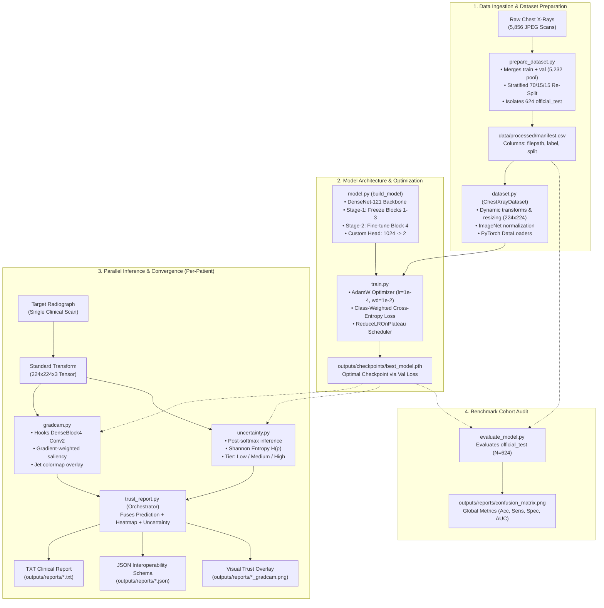
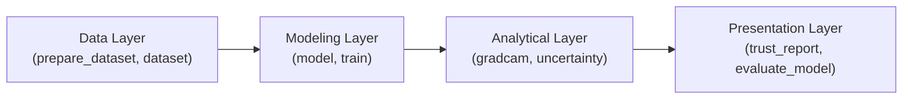

<div align="center">

# System Architecture & Pipeline Design
### Insight: Pediatric Pneumonia Detection & Clinical Decision Support System

[](https://pytorch.org/)
[](#4-design-principle-separation-of-concerns)
[](#5-the-trust-report-as-the-systems-convergence-point)
[](#2-end-to-end-data--processing-flow)

[System Overview](#1-system-overview) • [Data & Processing Flow](#2-end-to-end-data--processing-flow) • [Component Breakdown](#3-component-breakdown) • [Separation of Concerns](#4-design-principle-separation-of-concerns) • [The Trust Report](#5-the-trust-report-as-the-systems-convergence-point) • [Architectural Decisions](#6-key-architectural-decisions-summary)

</div>

---

## 1. System Overview

Insight is engineered not as a standalone mathematical classifier, but as an **end-to-end Clinical Decision Support System (CDSS)**. 

In high-stakes pediatric healthcare, a bare prediction probability (e.g., *"84% Pneumonia"*) is clinically uninformative and potentially hazardous. Clinicians require interpretability, confidence calibration, and operational context to make safe triage decisions under cognitive fatigue. Insight directly resolves this requirement by synthesizing four core dimensions into a unified, clinician-facing report:

```text
┌─────────────────────────────────────────────────────────────────────────────┐
│                           THE INSIGHT TRIAD                                 │
│                                                                             │
│   1. Categorical Prediction  ──► Binary Classification (Normal vs Pneumonia)│
│   2. Visual Explainability   ──► Grad-CAM Anatomic Saliency Heatmap         │
│   3. Predictive Uncertainty  ──► Normalized Shannon Entropy (Tiers: L/M/H)  │
│   4. Operational Action      ──► Actionable Protocol (Standard / Escalate)  │
└─────────────────────────────────────────────────────────────────────────────┘
```

By decoupling feature extraction, uncertainty calculation, and saliency visualization into modular sub-systems, Insight guarantees that every diagnostic output is accompanied by anatomical evidence and predictive hesitation metrics before human sign-off.

---

## 2. End-to-End Data & Processing Flow

The following flowchart illustrates the end-to-end lifecycle of the system—from raw radiograph ingestion and stratified dataset preparation, through deep transfer learning, to parallel inference and multimodal report synthesis:



---

## 3. Component Breakdown

The Insight codebase is partitioned into distinct functional modules within `src/`, adhering to high cohesion and minimal coupling:

| Module Path | Core Operational Responsibility | Primary Input(s) | Generated Output(s) / Artifacts |
| :--- | :--- | :--- | :--- |
| **`src/data/prepare_dataset.py`** | Ingests raw directory structures, remedies Kaggle's 16-image split, stratifies development pool, and isolates held-out test cohort. | `data/raw/chest_xray/` directory tree | `data/processed/manifest.csv` |
| **`src/data/dataset.py`** | PyTorch `Dataset` implementation handling on-the-fly augmentations (flips, rotations) and tensor normalization. | `manifest.csv`, raw image files | Normalized batches `(images, labels)` |
| **`src/model/model.py`** | Constructs DenseNet-121, executes two-stage parameter freezing, and attaches the binary classification head. | ImageNet pretrained weights | `nn.Module` model instance |
| **`src/model/train.py`** | Manages the training loop, computes class weights, tracks validation loss, triggers early stopping, and saves optimal weights. | DataLoaders, `build_model()` | `outputs/checkpoints/best_model.pth` |
| **`src/explainability/gradcam.py`** | Computes gradient-weighted class activation maps from the final convolutional layer of DenseBlock4. | Trained model, image tensor | 2D activation heatmap & RGB overlay image |
| **`src/evaluation/uncertainty.py`** | Computes Normalized Shannon Entropy ($\hat{H}$) from softmax probabilities and maps scores to clinical triage tiers. | Trained model, image tensor | Entropy float $[0, 1]$, Uncertainty tier (`Low`/`Med`/`High`) |
| **`src/evaluation/trust_report.py`** | Central orchestrator executing parallel inference, Grad-CAM, and uncertainty scoring to synthesize multimodal reports. | Image path, model checkpoint | Formatted TXT, structured JSON, diagnostic PNG |
| **`src/evaluation/evaluate_model.py`** | Evaluates the isolated benchmark cohort (`official_test`), generating ROC curves, confusion matrices, and aggregate metrics. | `best_model.pth`, test manifest split | `outputs/reports/confusion_matrix.png`, console metrics |

---

## 4. Design Principle: Separation of Concerns

Rather than assembling an end-to-end monolithic script, Insight enforces strict **Separation of Concerns (SoC)** across its structural layers:



### Architectural Benefits:
1. **Independent Module Reusability**: Each component operates autonomously. For example, `src/evaluation/uncertainty.py` can evaluate predictive entropy on any PyTorch classification architecture (ResNet, EfficientNet, ViT) without requiring changes to data loaders or training pipelines.
2. **Testability by Design (Future-Proof Quality Assurance)**: While formal test suites in `tests/` are deliberately deferred until internal APIs reach full stability, the decoupled architecture ensures the codebase is strictly testable by construction. Core functional units—such as mathematical entropy computation (`predict_with_uncertainty`), parameter freezing logic (`build_model`), and image transformation pipelines (`get_transforms`)—are isolated into self-contained modules that can be unit-tested directly without requiring future architectural refactoring.
3. **Decoupled Lifecycle Maintenance**: Saliency generation libraries (`pytorch-grad-cam`) or optimization routines (e.g., swapping AdamW for Lion) can be upgraded independently without risking side-effects in downstream reporting modules.
4. **Production Extensibility**: The decoupled inference pipeline allows `trust_report.py` to be wrapped seamlessly inside a FastAPI backend, Celery worker, or PACS integration service without refactoring deep learning logic.

---

## 5. The Trust Report as the System's Convergence Point

In standard machine learning workflows, explainability and uncertainty estimation are treated as disconnected exploratory post-hoc exercises. In Insight, **`src/evaluation/trust_report.py` serves as the unifying architectural convergence point**.

```text
┌─────────────────────────────────────────────────────────────────────────────┐
│                          INFERENCE ORCHESTRATION                            │
│                                                                             │
│               ┌───────────────────┐     ┌───────────────────┐               │
│               │    gradcam.py     │     │  uncertainty.py   │               │
│               │ (Anatomic Saliency)     │ (Predictive Risk) │               │
│               └─────────┬─────────┘     └─────────┬─────────┘               │
│                         │                         │                         │
│                         └────────────┬────────────┘                         │
│                                      ▼                                      │
│                         ┌─────────────────────────┐                         │
│                         │     trust_report.py     │                         │
│                         └────────────┬────────────┘                         │
│                                      │                                      │
│               ┌──────────────────────┼──────────────────────┐               │
│               ▼                      ▼                      ▼               │
│       [Clinical Text]        [EHR Interop JSON]     [Saliency Overlay]      │
│     Human-readable triage     Machine-readable for   Physician visual check │
│      queue recommendation     hospital IT databases  of apical/lobar focus  │
└─────────────────────────────────────────────────────────────────────────────┘
```

### Clinician-Centered Abstraction
A practicing pediatrician or emergency triage nurse should not be required to decipher softmax tensors or gradient matrices. The Trust Report translates complex mathematical internals into clear clinical imperatives:
- **Zero Technical Friction**: Outputs clear natural language directives (e.g., *"مطلوب مراجعة إلزامية من طبيب أشعة استشاري قبل اعتماد النتيجة"* / *"Mandatory senior radiologist review required prior to sign-off"*).
- **Multimodal Delivery**: Produces an instant text report (`.txt`) for terminal review, an interoperable schema (`.json`) for hospital Electronic Health Records (EHR/PACS), and a visual overlay (`.png`) that highlights anatomical regions of interest.
- **Fail-Safe Gatekeeping**: Connects predictive entropy directly to clinical workflow escalation, preventing "confidently wrong" or borderline predictions from slipping through without physician scrutiny.

---

## 6. Key Architectural Decisions Summary

The following table summarizes the foundational engineering decisions established in Insight, along with their concise clinical/mathematical justifications and cross-references:

| Architectural Dimension | Chosen Strategy | Core Engineering & Clinical Justification | Detailed Reference |
| :--- | :--- | :--- | :--- |
| **Model Backbone** | **DenseNet-121** | Feature reuse preserves low-level contours; validated by Stanford CheXNet benchmark. | [methodology.md#1-model-architecture](methodology.md#1-model-architecture) |
| **Parameter Freezing** | **Two-Stage Unfreezing** | Freezes early generic primitives (Blocks 1–3); fine-tunes deep pulmonary abstractions (Block 4). | [methodology.md#transfer-learning--fine-tuning-strategy](methodology.md#transfer-learning--fine-tuning-strategy) |
| **Dataset Splitting** | **70 / 15 / 15 + Held-Out** | Solves Kaggle's erratic 16-image validation split while preserving an uncorrupted 624-scan external benchmark. | [methodology.md#2-dataset-splitting-strategy](methodology.md#2-dataset-splitting-strategy) |
| **Class Imbalance** | **Weighted Cross-Entropy** | Mathematically balances gradients without duplicating scans, avoiding memorization of normal anatomy. | [methodology.md#3-handling-class-imbalance](methodology.md#3-handling-class-imbalance) |
| **Explainability Target** | **DenseBlock4 Conv2** | Final convolutional stage retaining rich semantic opacities while preserving 2D spatial coordinate mapping. | [methodology.md#5-explainability-grad-cam-implementation](methodology.md#5-explainability-grad-cam-implementation) |
| **Uncertainty Formulation** | **Normalized Shannon Entropy** | Maps post-softmax predictive dispersion to a $[0, 1]$ interval, establishing concrete triage operational tiers. | [methodology.md#6-predictive-uncertainty-estimation](methodology.md#6-predictive-uncertainty-estimation) |
