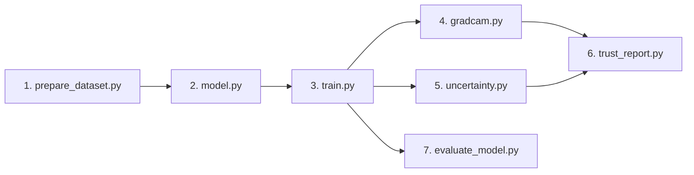

<div align="center">

# Local Development & Environment Setup Guide
### Insight: Pediatric Pneumonia Detection & Clinical Decision Support System

[](https://www.python.org/)
[](https://pytorch.org/)
[](#3-installing-dependencies)

[Prerequisites](#1-prerequisites) • [Repository Setup](#2-cloning-the-repository) • [Dependencies](#3-installing-dependencies) • [Dataset Ingestion](#4-downloading--structuring-the-dataset) • [Pipeline Execution](#5-executing-the-pipeline-step-by-step) • [Troubleshooting](#6-troubleshooting--common-issues) • [Directory Structure](#7-project-directory-structure)

</div>

---

## 1. Prerequisites

Before setting up Insight locally, ensure your machine satisfies the following hardware and software requirements:

- **Operating System**: Windows 10/11, Ubuntu 20.04+, or macOS (Apple Silicon / Intel).
- **Python Version**: Python `3.10` or `3.12` (Python 3.12 is actively tested and verified in our development environment).
- **Package Manager**: `pip` (v23.0+) and standard `venv` module.
- **Version Control**: `git` (v2.30+).
- **Hardware Recommendations**:
  - **GPU (Recommended for Training)**: NVIDIA GPU with $\ge 6\text{ GB}$ VRAM supporting CUDA 12.1 (e.g., RTX 3060, RTX 40-series, T4).
  - **CPU (Inference Only)**: Multi-core x86_64 / ARM64 processor with at least 8 GB RAM.

---

## 2. Cloning the Repository

Clone the project from GitHub and navigate into the root workspace directory:

```bash
git clone https://github.com/mariiammaysara/Insight.git
cd Insight
```

---

## 3. Installing Dependencies

### Step 1: Create and Activate a Virtual Environment

It is strongly advised to install dependencies inside an isolated virtual environment:

```bash
# Windows (PowerShell)
python -m venv .venv
.venv\Scripts\Activate.ps1

# Windows (Command Prompt)
python -m venv .venv
.venv\Scripts\activate.bat

# Linux / macOS (Bash / Zsh)
python3 -m venv .venv
source .venv/bin/activate
```

### Step 2: Install PyTorch with Hardware Acceleration

To leverage GPU acceleration, install the CUDA 12.1 build of PyTorch and TorchVision:

```bash
# For GPU Systems (CUDA 12.1):
pip install torch torchvision --index-url https://download.pytorch.org/whl/cu121

# For CPU-Only Systems:
pip install torch torchvision
```

### Step 3: Install Remaining Project Dependencies

Install the analytical, visualization, and explainability libraries from `requirements.txt`:

```bash
pip install -r requirements.txt
```

Verify the environment installation:
```bash
python -c "import torch, torchvision, numpy, pandas; print('PyTorch:', torch.__version__, '| CUDA Available:', torch.cuda.is_available())"
```

---

## 4. Downloading & Structuring the Dataset

Insight utilizes the **Chest X-Ray Images (Pneumonia)** dataset by Kermany et al. (hosted on Kaggle).

- **Kaggle Dataset Source**: [https://www.kaggle.com/datasets/paultimothymooney/chest-xray-pneumonia](https://www.kaggle.com/datasets/paultimothymooney/chest-xray-pneumonia)

### Option A: Using the Kaggle CLI
If you have configured your `kaggle.json` API token:
```bash
kaggle datasets download -d paultimothymooney/chest-xray-pneumonia -p data/raw/
unzip data/raw/chest-xray-pneumonia.zip -d data/raw/
```

### Option B: Manual Web Download
1. Download the archive from the Kaggle dataset page.
2. Extract the contents so that the raw files reside under `data/raw/chest_xray/`.

### Required Directory Structure:
The data preparation script expects the following directory hierarchy:

```text
data/raw/chest_xray/
├── train/
│   ├── NORMAL/      # (e.g., IM-0115-0001.jpeg, ...)
│   └── PNEUMONIA/   # (e.g., person1_bacteria_1.jpeg, ...)
├── val/
│   ├── NORMAL/
│   └── PNEUMONIA/
└── test/
    ├── NORMAL/
    └── PNEUMONIA/
```

---

## 5. Executing the Pipeline Step-by-Step

Insight is designed as an end-to-end modular pipeline. Execute each step sequentially from the project root:



### 1. Data Ingestion & Stratified Splitting
```bash
python src/data/prepare_dataset.py
```
*Scans raw folders, remedies Kaggle's 16-image validation split, executes the 70/15/15 stratified partition on the development pool, and generates `data/processed/manifest.csv`.*

### 2. Model Architecture & Freezing Sanity Check
```bash
python src/model/model.py
```
*Builds DenseNet-121, verifies selective parameter freezing (DenseBlocks 1–3 frozen, Block 4 trainable), and validates a forward pass with dummy tensors.*

### 3. Deep Transfer Learning & Model Training
```bash
python src/model/train.py
```
*Executes the complete training loop with class-weighted loss, dynamic learning rate decay, early stopping, and saves the optimal checkpoint to `outputs/checkpoints/best_model.pth`.*

### 4. Visual Explainability (Grad-CAM Saliency)
```bash
python src/explainability/gradcam.py
```
*Extracts gradient-weighted activation heatmaps targeting DenseBlock4 Conv2 and saves RGB overlay images to `outputs/gradcam/`.*

### 5. Predictive Uncertainty Quantification
```bash
python src/evaluation/uncertainty.py
```
*Computes Normalized Shannon Entropy ($\hat{H}$) across internal test radiographs and validates automated classification into Low, Medium, and High uncertainty tiers.*

### 6. Clinical Trust Report Generation
```bash
python src/evaluation/trust_report.py
```
*Synthesizes predictions, Grad-CAM overlays, and entropy scores into clinician-facing multimodal Trust Reports (`.txt`, `.json`, `.png`) in `outputs/reports/`.*

### 7. Global Benchmark Evaluation
```bash
python src/evaluation/evaluate_model.py
```
*Audits the best checkpoint on the isolated official benchmark test set ($N=624$), computing global metrics (Accuracy, Sensitivity, Specificity, AUC) and generating `outputs/reports/confusion_matrix.png`.*

---

## 6. Troubleshooting & Common Issues

### 1. `torch.cuda.is_available()` Returns `False` Despite Having an NVIDIA GPU
- **Cause**: PyTorch was installed from PyPI's default CPU-only wheel instead of the CUDA-indexed wheel repository.
- **Solution**: Uninstall the current build and reinstall the CUDA 12.1 wheel:
  ```bash
  pip uninstall -y torch torchvision
  pip install torch torchvision --index-url https://download.pytorch.org/whl/cu121
  ```

### 2. Windows PowerShell / CMD Arabic Encoding Errors (`UnicodeEncodeError`)
- **Cause**: Windows console standard output defaults to legacy codepages (e.g., CP1252), which fails when printing Arabic clinical directives.
- **Solution**: Insight scripts automatically call `sys.stdout.reconfigure(encoding="utf-8")`. If invoking Python in custom shells, configure the terminal encoding environment variable:
  ```powershell
  $env:PYTHONIOENCODING = "utf-8"
  ```

### 3. `FileNotFoundError: Manifest file data/processed/manifest.csv not found`
- **Cause**: Training or evaluation was triggered before dataset preparation.
- **Solution**: Run `python src/data/prepare_dataset.py` first to generate the required manifest.

### 4. `torch.cuda.OutOfMemoryError` During Training
- **Cause**: Mini-batch size exceeds available GPU VRAM.
- **Solution**: Reduce the batch size in `src/model/train.py` from `batch_size=32` to `16` or `8`.

---

## 7. Project Directory Structure

```text
Insight/
├── data/
│   ├── raw/                 # Raw Kaggle chest X-ray images (train, val, test)
│   └── processed/           # Generated manifest.csv tracking splits and labels
├── src/
│   ├── data/                # Dataset scanning, transforms, and PyTorch DataLoaders
│   ├── model/               # DenseNet-121 architecture, parameter freezing, and training
│   ├── explainability/      # Grad-CAM implementation and anatomical attention overlays
│   └── evaluation/          # Uncertainty estimation, Trust Reports, and offline evaluation
├── docs/                    # Architectural, clinical, and technical documentation
│   ├── architecture.md      # System design and pipeline flow
│   ├── methodology.md       # Medical modeling and mathematical formulation
│   ├── evaluation.md        # Official benchmark metrics and distribution shift analysis
│   ├── limitations.md       # Known constraints and failure modes
│   ├── api.md               # Complete Python API reference
│   ├── development.md       # Local installation and development setup
│   ├── contributing.md      # Engineering standards and contribution guidelines
│   └── clinical-guidelines.md # Clinical problem framing and regulatory disclaimer
├── outputs/
│   ├── checkpoints/         # Saved PyTorch model weights (best_model.pth)
│   ├── gradcam/             # Grad-CAM sample visualizations
│   └── reports/             # Trust Reports (JSON, TXT) and confusion_matrix.png
├── requirements.txt         # Project Python dependencies
├── LICENSE                  # MIT License
└── README.md                # Project landing documentation
```
