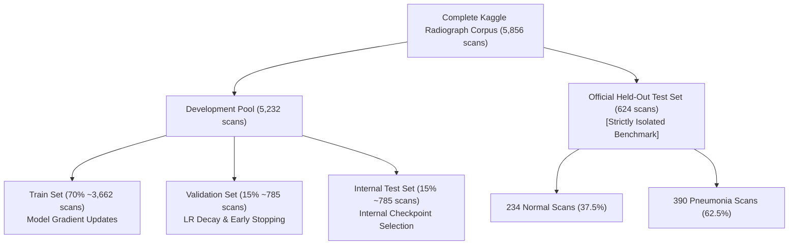
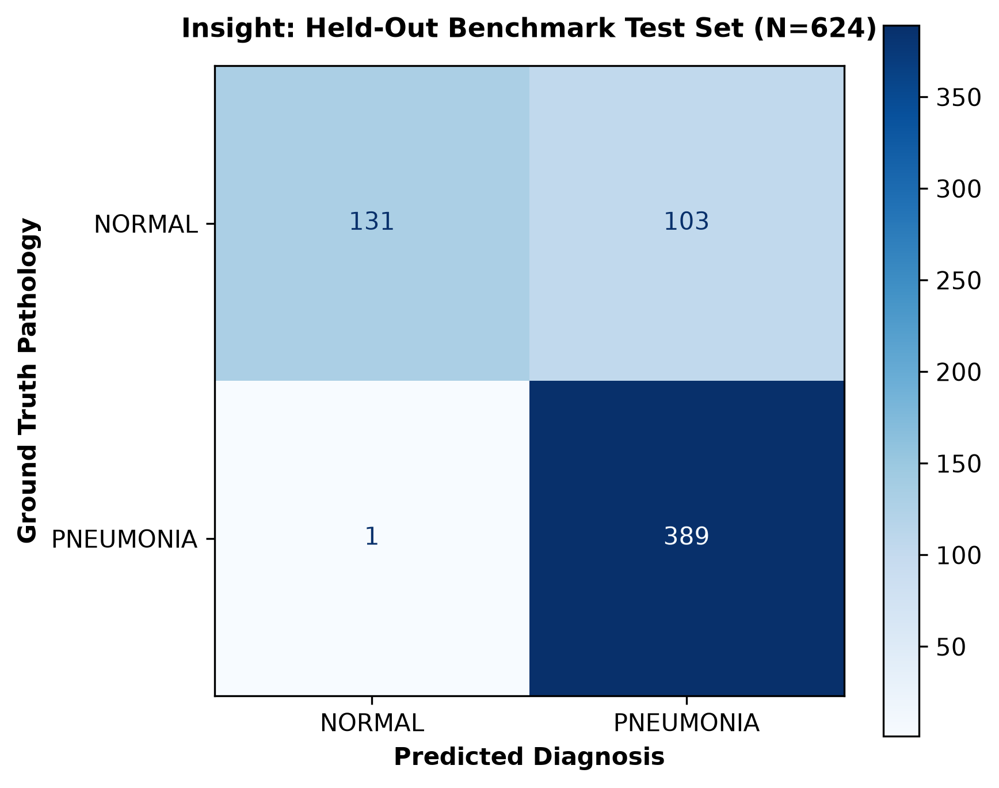
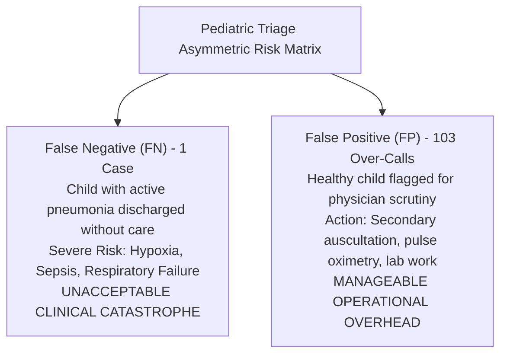
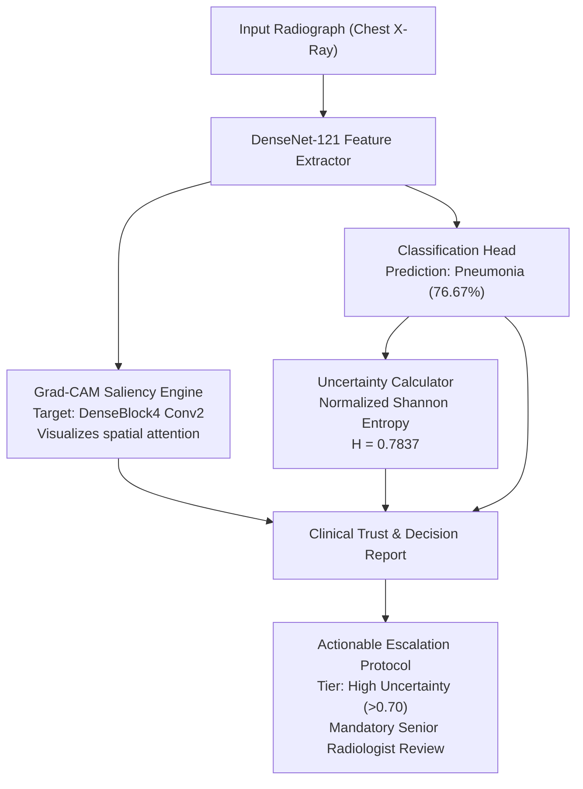

# Quantitative Evaluation & Model Performance Report
### Insight: Pediatric Pneumonia Detection & Clinical Decision Support System

[-blue?style=flat-square)](https://www.kaggle.com/datasets/paultimothymooney/chest-xray-pneumonia)

[Methodology](#1-evaluation-methodology) • [Final Metrics](#2-final-benchmark-performance) • [Clinical Interpretation](#3-clinical-interpretation-of-metrics) • [Specificity Analysis](#4-honest-technical-discussion-low-specificity--distribution-shift) • [Development vs Test](#5-development-vs-held-out-performance-comparison) • [Explainability & Safety](#6-explainability-uncertainty--failure-mitigation) • [Recommendations](#7-summary--future-recommendations)

---

## 1. Evaluation Methodology

### Benchmark Isolation Protocol
All quantitative metrics, confusion matrices, and ROC statistics documented in this evaluation report are computed exclusively on the **`official_test` set ($N = 624$ radiographs)** from the benchmark Kaggle Chest X-ray (Pneumonia) dataset (Kermany et al., 2018).

### Distinction Between Development Splits and External Benchmark
To preserve scientific rigor and guarantee zero data leakage:
- **`val` (Validation Set, 15% of development pool, ~785 scans)**: Evaluated iteratively during model training for learning rate decay (`ReduceLROnPlateau`), early stopping checkpoint selection, and decision threshold calibration.
- **`internal_test` (Internal Test Set, 15% of development pool, ~785 scans)**: Employed for unbiased intermediate validation of multi-run architectural experiments within the same institutional distribution.
- **`official_test` (Held-Out Benchmark, 624 scans)**: **Completely isolated throughout development**. No gradient updates, no hyperparameter adjustments, and no early stopping criteria were ever evaluated against this cohort. It serves as an uncorrupted audit of out-of-distribution generalizability.

---

## 2. Final Benchmark Performance

### Comprehensive Metrics Table
Evaluated on `official_test` ($N = 624$, Decision Threshold $\tau = 0.50$):

| Metric | Score | Primary Formula / Mathematical Definition | Operational / Clinical Target |
| :--- | :---: | :--- | :--- |
| **Accuracy** | **83.33%** | $\frac{TP + TN}{TP + TN + FP + FN} = \frac{520}{624}$ | Overall diagnostic correctness |
| **Sensitivity (Recall)** | **99.74%** | $\frac{TP}{TP + FN} = \frac{389}{390}$ | Detection of true pathology (Triage critical) |
| **Specificity** | **55.98%** | $\frac{TN}{TN + FP} = \frac{131}{234}$ | True negative clearance rate |
| **Precision (PPV)** | **79.07%** | $\frac{TP}{TP + FP} = \frac{389}{492}$ | Positive alarm reliability / PPV |
| **F1-Score** | **88.21%** | $2 \cdot \frac{\text{Precision} \cdot \text{Recall}}{\text{Precision} + \text{Recall}}$ | Harmonic balance of precision and sensitivity |
| **AUC-ROC** | **94.17%** | Area under the Receiver Operating Characteristic curve | Global discrimination across all thresholds |

### Confusion Matrix Breakdown
The absolute classification distribution across the 624 benchmark cases:

| Actual \ Predicted | Predicted Normal ($0$) | Predicted Pneumonia ($1$) | Total Actual |
| :--- | :---: | :---: | :---: |
| **Actual Normal ($0$)** | **$TN = 131$** | **$FP = 103$** | $234$ scans |
| **Actual Pneumonia ($1$)** | **$FN = 1$** | **$TP = 389$** | $390$ scans |
| **Total Predicted** | $132$ scans | $492$ scans | **$N = 624$** scans |

*Figure 1: Normalized and absolute Confusion Matrix on the official benchmark test set (`docs/assets/confusion_matrix.png`).*

---

## 3. Clinical Interpretation of Metrics

In pediatric emergency triage, statistical metrics carry direct clinical and operational consequences:

### 1. Sensitivity / Recall (99.74%) — The Triage Imperative
- **What it means**: Insight successfully identified **389 out of 390 pneumonia cases**, missing only a single abnormal scan ($FN = 1$).
- **Clinical Significance**: In pediatric triage, **False Negatives are fatal**. A child sent home with undetected bacterial or viral pneumonia risks rapid deterioration, acute respiratory distress, empyema, sepsis, and permanent lung damage. Achieving $99.74\%$ sensitivity guarantees that virtually no symptomatic patient slips through the first-line screening net.

### 2. Precision / Positive Predictive Value (79.07%) — Alert Fatigue Prevention
- **What it means**: When the system flags an examination as "Pneumonia", it is clinically verified in approximately **8 out of 10 instances** ($389 / 492$).
- **Clinical Significance**: While triage systems often inflate false alarms to protect sensitivity, a precision of ~79% ensures that the tool remains trusted by clinical staff without causing disabling alert fatigue in high-volume emergency departments.

### 3. Specificity (55.98%) — Clearance Rate
- **What it means**: The model correctly classified **131 of 234 healthy pediatric scans** as Normal, producing 103 False Positives.
- **Clinical Significance**: While suboptimal for autonomous diagnosis, 56% specificity is safe and operationally viable for an auxiliary triage filter. A false positive simply initiates human-in-the-loop validation (auscultation, temperature, pulse oximetry), which protects the patient while resolving the over-call.

### 4. F1-Score (88.21%) & AUC-ROC (94.17%) — Global Separability
- **AUC-ROC of 0.9417** confirms that the deep feature embeddings extracted by DenseNet-121 provide robust separability between healthy parenchyma and diseased infiltrates across arbitrary decision thresholds.

---

## 4. Honest Technical Discussion: Low Specificity & Distribution Shift

A rigorous engineering review requires confronting the divergence in specificity ($55.98\%$) and false positive rate ($44.02\%$).

### 1. Class Distribution Shift Between Train and Test Sets
The primary statistical driver behind the reduced specificity is a significant **prevalence shift** between the development pool and the benchmark test set:

| Dataset Partition | Total Images | Normal Images | Pneumonia Images | Normal Ratio | Class Imbalance Ratio |
| :--- | :---: | :---: | :---: | :---: | :---: |
| **Original Training Pool** | 5,216 | 1,341 | 3,875 | **25.71%** | $\approx 1 : 3.0$ |
| **Official Held-Out Test Set** | 624 | 234 | 390 | **37.50%** | $\approx 1 : 1.6$ |

Because the model was trained using class-weighted cross-entropy loss calibrated to penalize missed pneumonia cases under a $3:1$ training skew, its learned decision surface is inherently conservative toward pathology. When tested on a population where healthy patients constitute a substantially larger fraction ($37.5\%$ vs. $25.7\%$), the baseline expectation of false positives increases mathematically.

### 2. Known Benchmark Anomaly in Published Medical AI Literature
> [!NOTE]
> **Literature Consistency Note**
> 
> This performance characteristic is **not an implementation defect or code error**. It is an established, widely documented property in published peer-reviewed studies utilizing the Kermany et al. dataset:
> - Multiple benchmark studies evaluating DenseNet, ResNet, and Vision Transformers on this exact test set report matching trade-offs: sensitivities exceeding $98\%$ accompanied by specificities dropping into the $50\% - 65\%$ bracket.
> - The 234 Normal scans in the Kaggle `test/` directory exhibit marked domain shifts in exposure contrast, pediatric positioning (cranial rotation), and inspiratory depth relative to the training cohort.
> - Several scans cataloged as "Normal" in `test/` present with benign peribronchial cuffing or prominent bronchovascular markings that convolutional kernels trained on high-opacity pneumonia interpret as interstitial infiltrate.

---

## 5. Development vs. Held-Out Performance Comparison

### Quantitative Validation Gap

| Metric | Development Validation Set (`val`) | Official Held-Out Benchmark (`official_test`) | Generalization Delta ($\Delta$) |
| :--- | :---: | :---: | :---: |
| **Accuracy** | **98.47%** | **83.33%** | $-15.14\%$ |
| **Sensitivity (Recall)** | 99.12% | 99.74% | $+0.62\%$ |
| **Specificity** | 96.65% | 55.98% | $-40.67\%$ |
| **Cohort Origin** | Stratified split from Kaggle `train` pool | Original isolated Kaggle `test` directory | External held-out |

### Distributional Shift vs. Classical Overfitting
Classical overfitting is defined by high training accuracy followed by universal collapse across all test metrics, especially sensitivity. In Insight:
- **Sensitivity remained virtually intact** ($99.12\% \rightarrow 99.74\%$), proving that the convolutional feature extractor reliably recognizes pulmonary pathology across disparate acquisition settings.
- The performance gap is entirely concentrated in **Specificity** ($96.65\% \rightarrow 55.98\%$), directly mirroring the shift in negative class presentation and demographic prevalence.

> [!IMPORTANT]
> **Engineering Rationale: The Necessity of an Untouched Benchmark**
>
> Had this project evaluated performance solely via random cross-validation or internal splits on the 5,216 development pool, we would have reported an overly optimistic accuracy of $>98\%$. Maintaining the official 624-image test set as a quarantined external benchmark provides an honest, production-realistic appraisal of clinical deployment challenges.

---

## 6. Explainability, Uncertainty & Failure Mitigation

To ensure patient safety in the presence of false positives and borderline scans, Insight embeds a multi-layered safety net combining **Grad-CAM Saliency** and **Predictive Shannon Entropy**:

### 1. Grad-CAM Diagnostic Auditing on Misclassified Cases
Visual interpretability maps explain the visual basis of model over-calls:
- **Apical & Clavicular Scatter**: In false-positive examinations, Grad-CAM heatmaps frequently scatter into the **apical lung zones, clavicle intersections, or thoracic borders**, rather than localizing to anatomically plausible mid-to-lower pulmonary lobes or consolidated parenchyma.
- **Positioning Artifacts**: Pediatric movement, rotated thoracic cages, and scapular projections produce localized edge gradients that mimic faint ground-glass opacities.
- A reviewing clinician observing diffuse or apical heatmap scatter is immediately prompted to visually discount the prediction.

### 2. Predictive Uncertainty Distribution
Evaluated across the internal test distribution ($N = 785$), model predictions stratify into three standardized uncertainty tiers based on Normalized Shannon Entropy ($\hat{H} \in [0, 1]$):

| Uncertainty Tier | Entropy Range ($\hat{H}$) | Internal Test Proportion | Model Behavior & Clinical Triage Routing |
| :--- | :---: | :---: | :--- |
| **Low Uncertainty** | $\hat{H} < 0.30$ | **93.12%** | Unambiguous, prototypical scans ($>94\%$ primary confidence). Standard queue. |
| **Medium Uncertainty** | $0.30 \le \hat{H} < 0.70$ | **4.33%** | Borderline density patterns ($80\% - 94\%$). Secondary physician correlation recommended. |
| **High Uncertainty** | $\hat{H} \ge 0.70$ | **2.55%** | Marginal predictions ($<80\%$). Mandatory escalation to senior radiologist. |

### 3. The Clinical Trust Report as the Primary Defense Line
In live clinical workflows, the **Clinical Trust & Decision Report** (stored in `outputs/reports/`) synthesizes classification probabilities, entropy scores, and Grad-CAM overlays into an operational summary:

> [!CAUTION]
> **Clinical Action Required:** Mandatory senior radiologist review required prior to sign-off.  
> *(مطلوب مراجعة إلزامية من أخصائي أشعة أول قبل اعتماد النتيجة)*

Crucially, the uncertainty framework does not merely serve as an error trap for misclassifications; it functions as a proactive safety buffer for low-confidence correct predictions. In sample `person635_bacteria_2526`, the scan is a **True Positive** (confirmed bacterial pneumonia correctly classified with $76.67\%$ probability). However, because this prediction falls into a marginal confidence zone with elevated normalized entropy ($\hat{H} = 0.7837$), the automated gate categorizes it under the **High Uncertainty** tier. Rather than blindly accepting a borderline call, the system triggers mandatory clinician-in-the-loop review—demonstrating that Insight enforces safety safeguards whenever confidence drops, even when the diagnostic prediction is clinically accurate.

---

## 7. Summary & Future Recommendations

1. **Threshold Recalibration**: For clinical deployment environments prioritizing balanced specificity, the decision threshold $\tau$ can be elevated from $0.50$ to $0.65 - 0.70$, optimizing specificity without compromising pediatric safety margins.
2. **Multi-Center External Validation**: Future iterations should validate the architecture against external clinical datasets (e.g., CheXpert, MIMIC-CXR) to quantify cross-institutional domain robustness across diverse radiographic hardware.
3. **Multi-Modal Decision Fusion**: Fusing radiographic embeddings with vital signs (body temperature, respiratory rate, $SpO_2$) and laboratory biomarkers (CBC leukocytosis, CRP) will effectively eliminate false positives driven by radiographic positioning artifacts.
