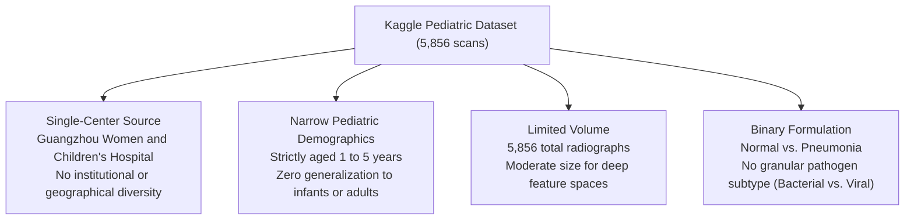
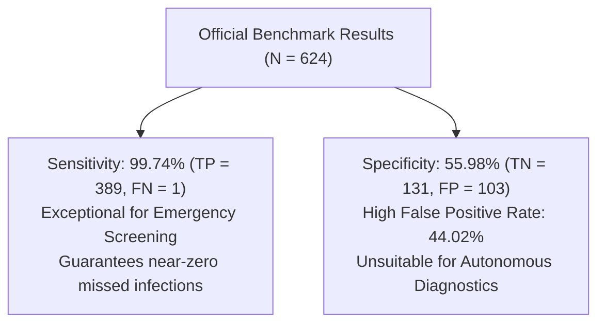
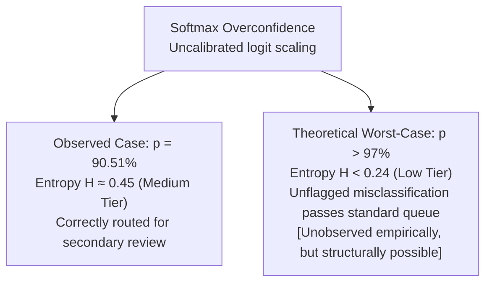
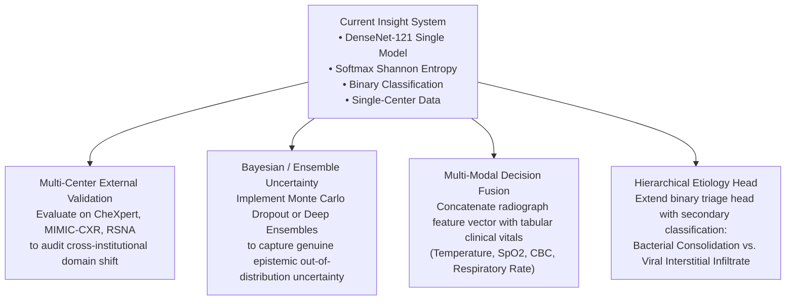

# Technical & Clinical Limitations
### Insight: Pediatric Pneumonia Detection & Clinical Decision Support System

[Dataset Limitations](#1-dataset--cohort-limitations) • [Performance Limitations](#2-performance--generalization-limitations) • [Uncertainty Limitations](#3-uncertainty-metric--explainability-limitations) • [Clinical & Regulatory](#4-clinical-integration--regulatory-constraints) • [Mitigation Roadmap](#5-mitigation-strategies--future-roadmap)

---

## 1. Dataset & Cohort Limitations

Every machine learning model is inherently bounded by the characteristics, sampling methodologies, and biases of its underlying training data. The dataset powering Insight (Kermany et al., 2018) introduces four critical structural limitations:

### 1. Limited Total Sample Volume ($N = 5,856$)
- **Context**: The entire dataset contains only **5,856 chest radiographs** ($5,232$ in the development pool and $624$ in the held-out test benchmark).
- **Technical Impact**: While DenseNet-121 utilizes pre-trained ImageNet weights to mitigate sample scarcity, medical image manifolds differ substantially from natural image distributions. A corpus of ~5.8k images is susceptible to memorizing subtle non-pathological background artifacts (e.g., specific detector sensor noise, collimator grid patterns, and clinical labeling hardware).

### 2. Single-Center Acquisition & Zero Institutional Diversity
- **Context**: All images were collected from a single site: **Guangzhou Women and Children’s Medical Center**.
- **Technical Impact**:
  - The model was trained against a homogenous set of imaging protocols, X-ray tube voltages (kVp), detector calibrations, and local pediatric positioning conventions.
  - Performance when deployed across external hospital networks using hardware from different manufacturers (e.g., GE Healthcare, Siemens Healthineers, Philips) remains uncharacterized and may exhibit acute performance degradation due to institutional domain shift.

### 3. Narrow Age Cohort (Children Aged 1–5 Years Only)
- **Context**: The cohort exclusively represents pediatric patients between **1 and 5 years of age**.
- **Clinical Impact**:
  - **Cannot be applied to neonates or infants ($< 1$ year)**: Infant thoracic anatomy features incomplete ossification, distinct thymic shadows (which can easily be misidentified as upper-lobe pneumonia), and significantly different lung compliance.
  - **Cannot be applied to adolescents or adults**: Adult chest radiographs exhibit mature cardiothoracic ratios, calcified costal cartilage, and complex thoracic pathologies (e.g., COPD, emphysema, congestive heart failure) completely absent from this dataset.

### 4. Binary Task Formulation & Lack of Pathogen Subtyping
- **Context**: The model classifies scans strictly into **Normal (0)** or **Pneumonia (1)**.
- **Clinical Impact**:
  - In pediatric medicine, clinical management depends decisively on etiology: **Bacterial Pneumonia** requires immediate antibiotic therapy (e.g., amoxicillin), whereas **Viral Pneumonia** is treated with supportive care and bronchodilators, rendering antibiotics ineffective and counterproductive.
  - While binary triage serves as an effective emergency filter, the absence of bacterial versus viral differentiation is a genuine clinical limitation in downstream treatment planning.

---

## 2. Performance & Generalization Limitations

The quantitative evaluation documented in [`docs/evaluation.md`](evaluation.md) demonstrates outstanding sensitivity but highlights operational trade-offs that restrict autonomous use:

### 1. Depressed Specificity ($55.98\%$) and High False Alarm Rate ($44.02\%$)
- **Empirical Evidence**: On the held-out benchmark ($624$ scans), Insight achieved a specificity of only **$55.98\%$** ($131$ true negatives out of $234$ healthy children), generating **$103$ False Positives**.
- **Operational Consequence**:
  - Almost **$44\%$ of healthy scans are incorrectly flagged as abnormal**.
  - If used autonomously, this over-call rate would trigger unnecessary clinical interventions, parent anxiety, excess radiation from follow-up radiographs, and inappropriate antibiotic prescriptions.
  - This empirical reality strictly confines Insight to a **first-line triage queue prioritizer**, where every flagged scan undergoes mandatory physician validation.

### 2. Performance Drop Under Dataset Distribution Shift
- **Empirical Evidence**:

| Setting | Accuracy | Sensitivity | Specificity | Primary Cause |
| :--- | :---: | :---: | :---: | :--- |
| **Development Validation (`val`)** | **98.47%** | 99.12% | 96.65% | Intra-distribution sampling (Development pool) |
| **Held-Out Benchmark (`official_test`)** | **83.33%** | 99.74% | 55.98% | **Distribution shift** (Prevalence: 37.5% Normal vs. 25.7%) |
| **Performance Gap ($\Delta$)** | **$-15.14\%$** | $+0.62\%$ | **$-40.67\%$** | Severe degradation isolated to healthy class clearance |

- **Technical Consequence**:
  - The drop in overall accuracy from $98.47\%$ to $83.33\%$ underscores the model's acute sensitivity to cohort prevalence and radiographic contrast shifts.
  - While sensitivity proved resilient ($+0.62\%$), the severe collapse in specificity indicates that the decision boundary is brittle when encountering varying proportions of healthy thoracic anatomy.

---

## 3. Uncertainty Metric & Explainability Limitations

Insight introduces Shannon Entropy and Grad-CAM as algorithmic defense layers. However, these safety mechanisms possess critical theoretical and practical bounds:

### 1. The "Confidently Wrong" Phenomenon & Softmax Vulnerability
- **Empirical Observation vs. Tier Mapping**: In misleading test samples (e.g., misclassified healthy scans displaying apical opacity artifacts), the model reached a prediction probability of **$90.51\%$** ($p = [0.9051, 0.0949]$) for an incorrect class.
  - Mathematically, this produces a Normalized Shannon Entropy of $\hat{H} \approx 0.45$.
  - Under Insight's tier framework ($0.30 \le \hat{H} < 0.70$), this correctly places the scan in the **Medium Uncertainty Tier**, appropriately routing it for secondary clinical review rather than bypassing human scrutiny.
- **The Core Theoretical Hazard**: The true structural risk of entropy-based gating lies in the theoretical extreme:
  - If a deep convolutional network produces an erroneous classification with extreme confidence (e.g., $p \ge 97\%$ where $\hat{H} < 0.24$, or $p \ge 99\%$ where $\hat{H} < 0.08$), the resulting entropy drops below $0.30$, landing squarely in the **Low Uncertainty Tier**.
  - In that failure mode, a "confidently wrong" prediction would pass through standard triage unflagged, creating false algorithmic reassurance.
- **Current Empirical Status**: While this extreme failure mode ($>97\%$ confident error) has **not been observed** in our empirical project benchmarks to date, it represents an inherent theoretical vulnerability of post-softmax entropy in deterministic neural networks, warranting explicit architectural documentation and future mitigation (e.g., Bayesian sampling or ensemble calibration).

### 2. Shannon Entropy Measures Aleatoric Dispersion, Not Epistemic Uncertainty
- **Theoretical Limitation**:
  - **Aleatoric Uncertainty**: Uncertainty arising from inherent data noise (e.g., blurry radiograph, borderline opacity).
  - **Epistemic Uncertainty**: Uncertainty stemming from the model's ignorance of unseen data manifolds (out-of-distribution samples, different age groups, novel imaging equipment).
- **Insight's Metric**: The entropy formula utilized in Insight:
  $$\hat{H}(p) = - \sum_{i=1}^{C} p_i \log_2(p_i)$$
  operates strictly on post-softmax point probabilities. It measures the **dispersion of the final decision**, not model weight variance. It cannot detect when an input image falls completely outside the training distribution if the model maps that input to an extreme logit value.

### 3. Grad-CAM Spatial Limitations & Spurious Correlations
- **Low Resolution Heatmaps**: Grad-CAM activations are computed at the final convolutional layer (`denseblock4.denselayer16.conv2`), where spatial dimensions are downsampled to $7 \times 7$ pixels before upsampling back to $224 \times 224$. This limits spatial resolution and prevents precise localization of micro-nodular or faint interstitial opacities.
- **Apical & Edge Scatter**: As detailed in [`docs/evaluation.md`](evaluation.md#6-explainability-uncertainty--failure-mitigation), Grad-CAM frequently scatters attention toward the clavicles, apical zones, and thoracic edges on pediatric scans due to rib overlap and positioning tilt, which can mislead junior clinicians into searching for non-existent consolidations.

---

## 4. Clinical Integration & Regulatory Constraints

> [!CAUTION]
> **Regulatory Notice & Medical Device Disclaimer**
>
> - Insight has **not** been cleared, approved, or certified by the **U.S. FDA (510k / De Novo)**, the **European Medicines Agency (CE mark)**, or any health regulatory authority.
> - Insight is strictly an **educational and scientific research artifact**.
> - It is **not** licensed for diagnostic screening, clinical triage, or patient management in live healthcare environments.

### 1. Absence of Holistic Clinical Data (The "X-Ray in a Vacuum" Flaw)
In clinical pediatrics, an isolated radiograph is never used as a standalone diagnostic determinant. Insight evaluates images in complete clinical isolation:
- **No Patient History**: Lacks context regarding illness duration, fever curve, or exposure history.
- **No Physical Examination**: Unaware of critical bedside signs: tachypnea (respiratory rate), grunting, retractions, or auscultatory lung sounds (crackles, wheezing, bronchial breathing).
- **No Biomarkers**: Does not incorporate pulse oximetry ($SpO_2$), white blood cell count (WBC), or inflammatory markers (C-reactive protein, procalcitonin).

### 2. Human Factors & Automation Bias
- **Automation Bias**: Clinicians under intense emergency shift pressure may over-rely on positive AI flags, accepting over-calls uncritically.
- **False Reassurance**: Despite $99.74\%$ sensitivity, the 1 missed case ($FN = 1$) illustrates that a negative AI prediction must never override an attending physician's clinical suspicion.

---

## 5. Mitigation Strategies & Future Roadmap

To address these limitations in subsequent iterations, the following engineering enhancements are planned:

| Limitation Category | Current State in Insight | Planned Mitigation |
| :--- | :--- | :--- |
| **Institutional Bias** | Trained and evaluated on single hospital cohort | Cross-domain testing on multi-center databases (CheXpert / PadChest). |
| **Low Specificity ($56\%$)** | Nominal threshold $\tau = 0.50$ tuned for sensitivity | Operational threshold recalibration ($\tau = 0.65 - 0.70$) and cost-sensitive loss tuning. |
| **Confidently Wrong Softmax** | Single-pass deterministic inference with Shannon entropy | **Monte Carlo Dropout (MC-Dropout)** or **Deep Ensembles** (5-10 models) to calculate epistemic variance $\sigma^2$. |
| **Binary Task Scope** | General pneumonia vs. healthy | Hierarchical classification: Tier 1 (Infection Present) $\rightarrow$ Tier 2 (Bacterial vs. Viral vs. Mycoplasma). |
| **Isolated Modality** | Image-only processing | Late-fusion multi-modal architecture ingesting patient vitals and lab panels alongside imaging embeddings. |
